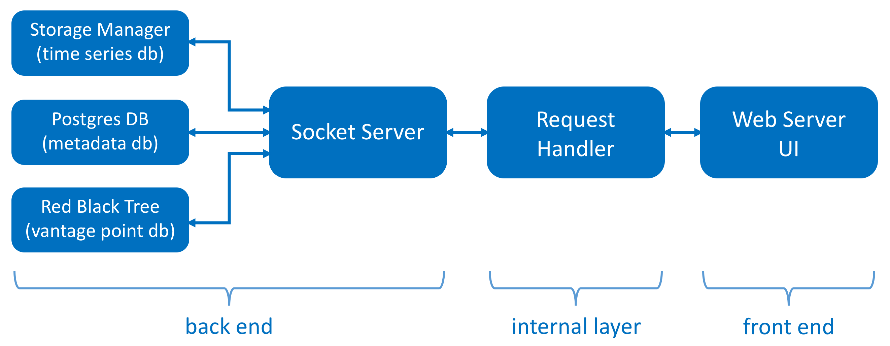

#CS207 Project

###Team: CSE-O1
###Members: Bingfeng Xia, Ming-Long Wu, Qin Lyu, Rui Zhao, Xinyuan Wang

###Introduction

This is a final project repo for Harvard CS207 system development course.

Implemented 3 database like systems in this project:
- Storage manager and associated SMTimeSeries
- postgres database with metadata
- socket server fronted red-black tree based Vantage Point database

All 3 of these talk to the REST HTTP server. The whole project was installed on AWS, including all the python, postgres, nginx, etc.

###File folder
- **/cs207rbtree** red black tree, can be installed separately
- **/frontend** web interface
- **/scripts** scripts to generate database
- **/server** server related
- **/simsearch** similarity search
- **/storagemanager** file storage manager
- **/timseries** time series

###Website on Amazon AWS
http://54.237.247.237/

###Installation
- **/setup.sh** script to install required packages on an empty EC2 virtual machine
- **/start_server.sh** script to setup project on an EC2 virtual machine

